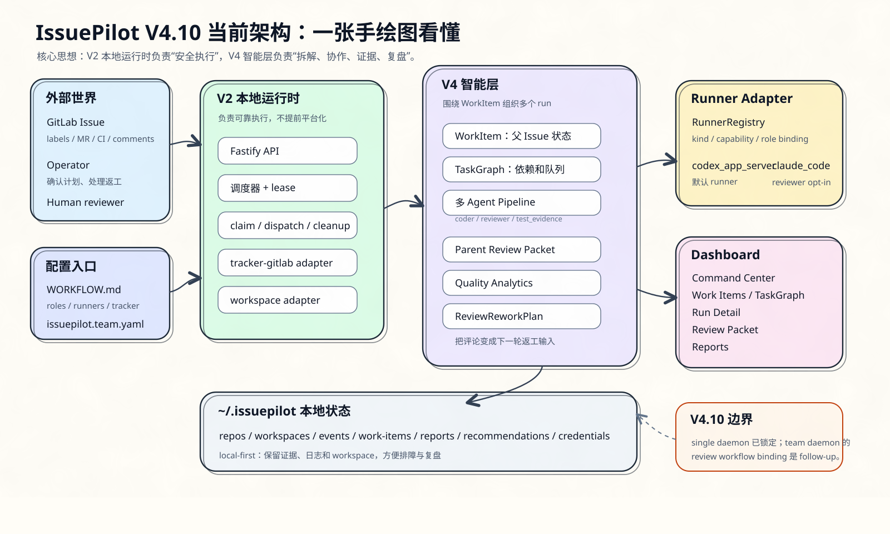
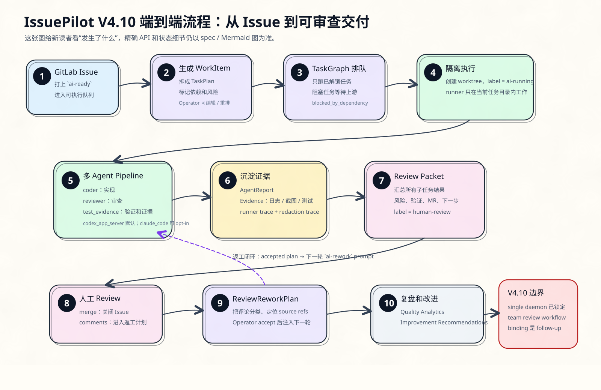

# IssuePilot

[English](README.en.md) | [简体中文](README.md)

IssuePilot is a local GitLab Issue AI executor. Add `ai-ready` to a GitLab
Issue, and IssuePilot creates an isolated worktree, runs Codex app-server,
commits a branch, opens a Merge Request and hands the result to a human reviewer.

The short version:

```text
GitLab Issue -> local IssuePilot daemon -> Codex changes code -> GitLab MR -> human review
```

IssuePilot does not auto-merge MRs, and it is not a SaaS product. Start with a
personal machine or a team machine pilot.


## V4 At A Glance

The two hand-drawn infographics below are for first-time readers: start with
the system boundary and core modules, then follow the loop from GitLab Issue to
MR review and rework. The precise architecture and flow diagrams remain in the
documentation section.





## The Three Directories To Understand First

Most first-time confusion comes from where commands should run. Keep these
directories separate:

| Directory              | Purpose                                                              | Must you enter it?                                |
| ---------------------- | -------------------------------------------------------------------- | ------------------------------------------------- |
| IssuePilot source repo | This `symphony` checkout, used to install or develop IssuePilot      | Yes, during installation                          |
| Central config dir     | Contains `issuepilot.team.yaml`, `projects/*.yaml`, `workflows/*.md` | Enter it to start, or pass `--config`             |
| Target project         | The real GitLab project that AI should modify                        | No, put its GitLab project and repo URL in config |
| `~/.issuepilot`        | Mirrors, worktrees, logs and state created by IssuePilot             | Usually no                                        |

Installing IssuePilot and running it against a project are separate steps:

1. Install the `issuepilot` command from this repository.
2. Prepare a central config directory.
3. Start IssuePilot with `issuepilot.team.yaml`.

## Shortest Install Path

Run this inside the IssuePilot source repository:

```bash
corepack enable
pnpm install
pnpm release:pack
npm install -g ./dist/release/issuepilot-*.tgz
issuepilot doctor
```

When every `issuepilot doctor` check prints `[OK]`, the local installation is
ready.

If you are only developing the source tree and do not want a global install:

```bash
pnpm build
pnpm exec issuepilot doctor
```

## Shortest Usage Path

After preparing central config, start:

```bash
cd /path/to/issuepilot-config
issuepilot validate
issuepilot run
```

Open another terminal for the dashboard:

```bash
issuepilot dashboard
```

Open:

```text
http://localhost:3000
```

## What A First Target Project Needs

The target project is the GitLab repository that IssuePilot will actually
operate on. For the first setup, prepare:

1. A GitLab project that your machine can push to.
2. Six labels: `ai-ready`, `ai-running`, `human-review`, `ai-rework`, `ai-failed`, `ai-blocked`.
3. A project file and workflow profile in central config.
4. GitLab OAuth or a token environment variable.
5. One small test Issue with the `ai-ready` label.

See [Quick Start](./USAGE.md) for the full example.

## What It Does

1. Polls GitLab Issues labeled `ai-ready` or `ai-rework`.
2. Creates an isolated worktree for each task.
3. Starts a Codex app-server runner inside that worktree.
4. Creates or updates a branch and Merge Request.
5. Writes the handoff note, validation result, risk note and MR link back to the Issue.
6. Shows runs, work items, review packets and reports in the dashboard.


## Continue Reading

- [快速使用中文](./USAGE.zh-CN.md): install through the first Issue.
- [Quick Start English](./USAGE.md): English quick start.
- [Docs home](./docs/README.md): design, roadmap and architecture docs.
- [Roadmap](./docs/roadmap.md): version plan.
- [IssuePilot design spec](./docs/superpowers/specs/2026-05-11-issuepilot-design.md): product and architecture source of truth.

## Development And Verification

For docs-only changes, run:

```bash
git diff --check
```

For code changes, prefer:

```bash
SKIP_E2E=1 bash scripts/ci-equivalent-check.sh
```

## License

See [LICENSE](./LICENSE).
