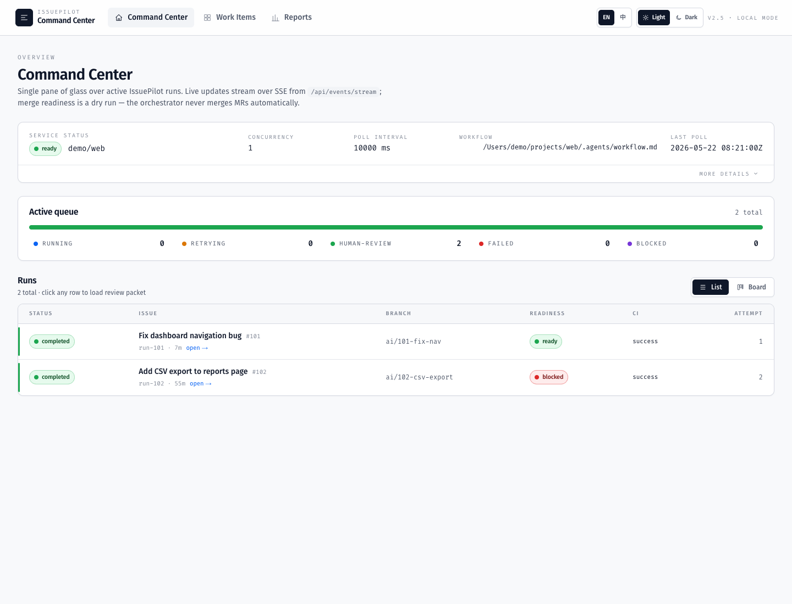

# IssuePilot

[English](README.en.md) | [简体中文](README.zh-CN.md)

IssuePilot 把 GitLab Issues 转成隔离的、可审查的 AI engineering runs。团队不需要盯着
agent 会话，而是通过 Issue、MR、Review Packet 和 dashboard 管理交付。

[快速启动](./docs/getting-started.zh-CN.md) · [文档中心](./docs/README.md) · [Roadmap](./docs/roadmap.md)



## 为什么需要 IssuePilot

AI coding agent 的难点不是“能不能写代码”，而是团队怎样安全地分派、隔离、审查和返工。
IssuePilot 把这些动作放回工程团队已经熟悉的 GitLab Issue / MR 流程里。

## 工作方式

1. 给 GitLab Issue 添加 `ai-ready`。
2. orchestrator claim issue，并在 `~/.issuepilot` 创建隔离 worktree。
3. runner 在 worktree 内执行任务。
4. IssuePilot 创建 branch / MR / handoff note / run report。
5. dashboard 展示 Command Center、Run Detail、Review Packet 和 Reports。
6. 人工 reviewer 决定 merge、`ai-rework`、`ai-blocked` 或 `ai-failed`。


## 核心能力

- GitLab label-driven orchestration。
- local-first workspace isolation。
- Codex app-server runner。
- dashboard Command Center。
- MR handoff note。
- Review Packet / Evidence。
- Review feedback → rework plan。
- Quality analytics 和 improvement loop。
- Runner adapter contract，支持 runner kind / provenance / redaction trace。

## 当前成熟度

| 阶段 | 状态 |
| --- | --- |
| P0 / V1 | 单机闭环已完成 |
| V2 / V2.5 | team runtime 和 Command Center 已完成 |
| V4.1-V4.10 | intelligent workbench 已完成 release lock |
| V3 | production execution platform 尚未开始 |

IssuePilot 当前适合本地开发、团队机器试点和内部 dog-food；它还不是 SaaS，也不会自动 merge MR。

## 快速启动

```bash
corepack enable
pnpm install
pnpm build
pnpm exec issuepilot doctor
pnpm dev:orchestrator
```

另开一个终端：

```bash
NEXT_PUBLIC_API_BASE=http://127.0.0.1:4738 pnpm dev:dashboard
```

完整步骤见 [Getting Started](./docs/getting-started.zh-CN.md)。

## 文档

- [文档中心](./docs/README.md)
- [Getting Started 中文](./docs/getting-started.zh-CN.md)
- [Getting Started English](./docs/getting-started.md)
- [Roadmap](./docs/roadmap.md)
- [用户手册中文](./USAGE.zh-CN.md)
- [User Guide English](./USAGE.md)
- [V4 手绘架构信息图](./docs/superpowers/diagrams/v4-architecture-handdrawn.svg)
- [V4 手绘流程信息图](./docs/superpowers/diagrams/v4-flow-handdrawn.svg)
- [V4 架构图](./docs/superpowers/diagrams/v4-architecture.svg)
- [V4 端到端流程图](./docs/superpowers/diagrams/v4-flow.svg)

## 开发与验证

文档变更至少运行：

```bash
git diff --check
```

涉及代码时优先运行：

```bash
SKIP_E2E=1 bash scripts/ci-equivalent-check.sh
```

## License

见 [LICENSE](./LICENSE)。
