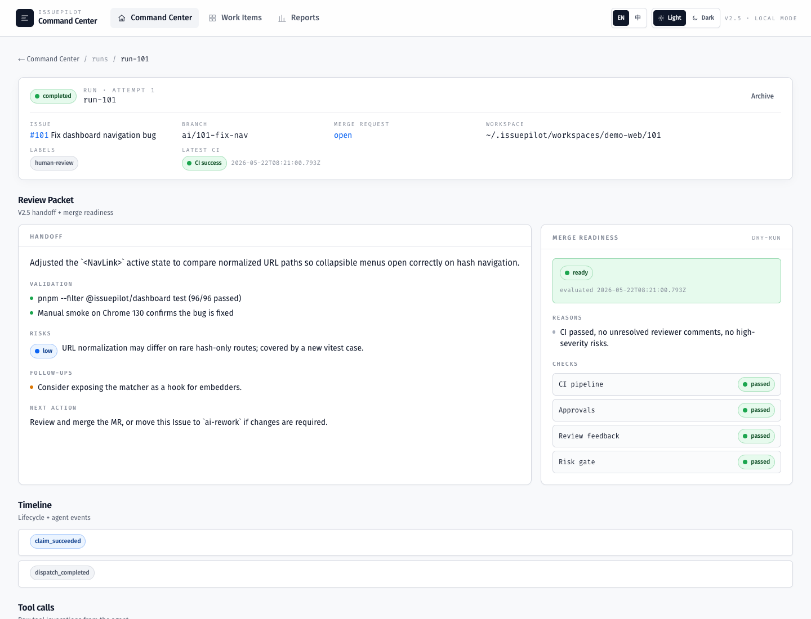

# Getting Started

This page is the shortest path to running IssuePilot locally. For the full user
guide, see [USAGE.md](../USAGE.md).

## What You Will Start

- orchestrator: an independent Node daemon. The default API is `http://127.0.0.1:4738`.
- dashboard: a Next.js dashboard for Command Center, run detail, review packet and reports.
- workspace: IssuePilot keeps mirror repositories, worktrees, event logs and reports under `~/.issuepilot`.



## Requirements

- Node.js `>=22 <23`
- pnpm `10.33.2`, enabled through `corepack`
- Git
- A GitLab test project you can push to
- Codex CLI / Codex app-server login state

## Start From Source

```bash
corepack enable
pnpm install
pnpm build
pnpm exec issuepilot doctor
```

Start the orchestrator:

```bash
pnpm dev:orchestrator
```

In another terminal, start the dashboard:

```bash
NEXT_PUBLIC_API_BASE=http://127.0.0.1:4738 pnpm dev:dashboard
```

Open the dashboard:

```text
http://localhost:3000
```

If the home page shows Command Center and the service status is not error, the dashboard is connected to the orchestrator.

## Install A Local Tarball

```bash
pnpm release:pack
npm install -g ./dist/release/issuepilot-*.tgz
issuepilot doctor
```

## Minimal WORKFLOW.md

Create `.agents/workflow.md` in your test project:

```markdown
# IssuePilot Workflow

## Goal

Implement the GitLab Issue as a small, reviewable change.

## Rules

- Keep the change scoped to the issue.
- Run focused tests before handoff.
- Open a merge request and leave a concise handoff note.
```

## GitLab Labels

Prepare at least these labels:

```text
ai-ready
ai-running
human-review
ai-rework
ai-failed
ai-blocked
```

## First Issue Run

1. Create a small Issue in your GitLab test project.
2. Add the `ai-ready` label.
3. Confirm the orchestrator logs show claim / dispatch / handoff.
4. Inspect the run detail page in the dashboard.
5. Inspect the handoff note, validation, risk and next action in the MR.
6. If rework is needed, move the Issue to `ai-rework`; if it can be merged, keep it in `human-review` for a human reviewer.

## Common Startup Failures

| Symptom | Check |
| --- | --- |
| dashboard shows `GET /api/state failed` | Confirm `pnpm dev:orchestrator` is running and `NEXT_PUBLIC_API_BASE` points to `http://127.0.0.1:4738` |
| GitLab returns 401 / 403 | Confirm the token comes from the environment variable configured by `tracker.token_env`; do not write tokens into workflow files |
| Codex runner is unavailable | Re-login to Codex CLI / app-server and run `issuepilot doctor` |
| branch push fails | Confirm the test project remote, SSH key and GitLab permissions |
| workspace state is confusing | Inspect the project / issue workspace and event logs under `~/.issuepilot` |

## Next Steps

- Read [docs/README.md](./README.md) for the documentation map.
- Read [Roadmap](./roadmap.md) for current maturity.
- Read [USAGE.md](../USAGE.md) for team mode, review packet and operations.
