# IssuePilot Roadmap

IssuePilot 当前处在 local-first / team-machine pilot 阶段。它已经能把 GitLab Issue
转成隔离 worktree 内的 AI engineering run，并把 MR、review packet、quality analytics
和 review rework plan 带回给人工 reviewer。

## Current Status

| 阶段 | 状态 | 含义 |
| --- | --- | --- |
| P0 / V1 | 已完成 | 单机 GitLab Issue → worktree → runner → MR → human review 闭环 |
| V2 | 已完成 | team runtime、dashboard operations、CI feedback、review feedback sweep、workspace retention |
| V2.5 | 已完成 | Command Center，支持 list / board / review packet inspector |
| V4.1-V4.10 | 已完成 release lock | workflow spine、task graph、review packet evidence、quality analytics、improvement loop、多 agent 协作、runner adapter、第二 runner dog-food、智能 review workflow |
| V3 | 未开始 | production execution platform：RBAC、Postgres、多 worker、production sandbox、预算和 observability |

## Product Flow

## Architecture

Historical V2 diagrams remain available for the team-operable runtime foundation:

- [V2 architecture](./superpowers/diagrams/v2-architecture.svg)
- [V2 flow](./superpowers/diagrams/v2-flow.svg)

## Completed Capabilities

- GitLab label-driven orchestration：`ai-ready`、`ai-running`、`human-review`、`ai-rework`、`ai-failed`、`ai-blocked`。
- `~/.issuepilot` workspace：mirror、worktree、event logs、reports。
- Codex app-server runner：本地隔离 cwd / sandbox 执行。
- Dashboard：Command Center、Run Detail、Work Items、Reports。
- Review Packet / Evidence：把 agent handoff、validation、risk、MR 和 evidence 汇总给 reviewer。
- Review feedback / rework plan：把人工 review comment 转成可审计返工计划。
- Runner adapter contract：runner kind、runner id、runner events 和 redaction trace。
- Quality analytics：从历史 run report 聚合失败模式和改进建议。

## Next: V4 Pilot Hardening

下一步不是直接进入 V3，而是用一个真实团队测试项目做 V4 pilot：

1. 用真实 GitLab issue 跑 single-project flow。
2. 用 dashboard 检查 Command Center、Run Detail、Review Packet 和 Reports。
3. 验证 `ai-rework` 能把 review feedback 带入下一轮 run。
4. 记录 blocker，特别是 Codex / Claude Code runner 登录态、workspace cleanup 和 MR handoff。
5. 决定 V3 production platform 的最小边界。

## Deferred To V3

- 多租户 SaaS。
- RBAC / SSO。
- Postgres 持久化。
- 多 worker 调度。
- production sandbox。
- budget / quota。
- OpenTelemetry 和长期指标。
- 自动 merge。

## Source Of Truth

- IssuePilot 总设计 spec：`docs/superpowers/specs/2026-05-11-issuepilot-design.md`
- V4 intelligent workbench spec：`docs/superpowers/specs/2026-05-17-issuepilot-v4-intelligent-workbench-design.md`
- V4.10 release lock acceptance：`docs/superpowers/plans/2026-05-22-issuepilot-v4-10-release-lock-acceptance.md`
